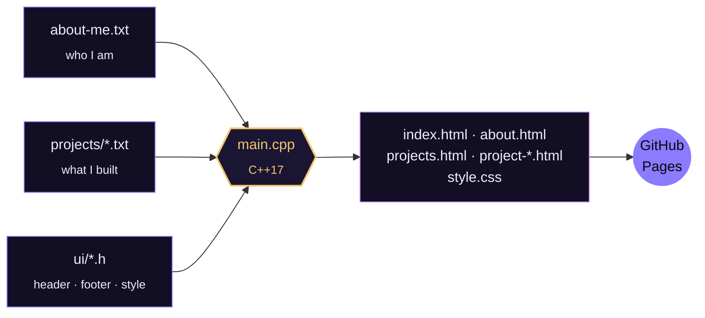

<div align="center">


<br>

[](https://hriduan.github.io/E-Portfolio_Hriduan/)
[](main.cpp)
[](#-what-makes-it-different)
[](https://hriduan.github.io/E-Portfolio_Hriduan/)

**A dark, chip-inspired portfolio that is generated by a C++ program.**
<br>
*You edit two kinds of text files. The compiler does the rest.*

</div>

<br>

## `01` &nbsp; What makes it different

| | |
|---|---|
| **C++ builds everything** | One program reads your text files and writes every `.html` page and `style.css`. |
| **Zero JavaScript** | The loader, mobile menu, photo viewer, marquee and scroll effects are pure CSS. |
| **One file for you** | Name, contact, skills, education, experience: all in [`about-me.txt`](about-me.txt). |
| **One file per project** | Drop a file into [`projects/`](projects) and the site grows by itself. |
| **Self-updating numbers** | The "hands-on projects" number on the home page counts the project files. |
| **Builds itself on GitHub** | Upload a file, and a GitHub Action rebuilds the pages for you. |

<br>

## `02` &nbsp; How it flows



<br>

## `03` &nbsp; Folder map

```text
E-Portfolio_Hriduan/
│
├── main.cpp                 ← run this: it builds the whole website
├── about-me.txt             ← ALL information about me (edit here)
├── index.html               ← the pages made by the program
├── about.html · projects.html · experience.html · contact.html
├── project-<name>.html      ← one page per project (made by the program)
├── style.css                ← the design (made by the program)
├── README.md                ← you are here
│
├── projects/                ← EVERYTHING about projects
│   ├── fsmd-controller-asic-fpga.txt   one file = one project
│   ├── digital-voting-machine.txt
│   ├── smart-agriculture-model.txt
│   ├── solar-street-light.txt
│   ├── ultrasound-sonar-rfid.txt
│   ├── audio-signal-filtering.txt
│   ├── _template.txt                   copy this to add a project
│   ├── project_loader.h                finds and reads the project files
│   └── project_pages.h                 project tiles and project pages
│
├── ui/                      ← EVERYTHING about the look
│   ├── style.h                         colors, fonts, animations (CSS)
│   ├── layout.h                        header, menu, loader, chip drawing
│   ├── footer.h                        the footer
│   ├── pages.h                         home, about, experience, contact
│   └── site_data.h                     reads about-me.txt
│
├── assets/                  ← ALL images + the CV
└── .github/workflows/       ← automatic build on GitHub
```

<br>

## `04` &nbsp; Build it

Run these from the **main folder** (the one that contains `ui`, `projects` and `assets`):

```bash
g++ -std=c++17 main.cpp -o build_site
./build_site                # Windows: build_site.exe
```

Open `index.html` in a browser. Changed only a text file (`about-me.txt` or a project)? You do **not** need to compile again. Just run `./build_site` once more.

<br>

## `05` &nbsp; Edit anything

| I want to change... | Open this file |
|---|---|
| name, email, phone, LinkedIn, location, tagline, about text | [`about-me.txt`](about-me.txt) |
| the numbers on the home page (CGPA, leader roles) | [`about-me.txt`](about-me.txt) → `[stats]` |
| interests, education, experience, skills | [`about-me.txt`](about-me.txt) |
| the words that type themselves on the home page | [`about-me.txt`](about-me.txt) → `[typing words]` |
| a project (text, photos, tags) | that project's file in [`projects/`](projects) |
| the footer (columns, links, bottom line) | [`ui/footer.h`](ui/footer.h) |
| colors, fonts, spacing, animations | [`ui/style.h`](ui/style.h) (colors are at the top, in `:root`) |
| menu links, loader, chip drawing | [`ui/layout.h`](ui/layout.h) |
| layout of Home / About / Experience / Contact | [`ui/pages.h`](ui/pages.h) |
| profile photo or CV | replace `assets/profile.jpg` or `assets/Hriduan_CV.pdf` (same file name) |

<br>

## `06` &nbsp; Add a new project

1. Copy [`projects/_template.txt`](projects/_template.txt) and give the copy a new name, like `line-follower-robot.txt`.
2. Fill in the title, category, summary, details, features, tools and photos.
3. Put the real photos in `assets/` with the same names you wrote in the file.
4. Build again (or upload the file to GitHub).

That is all. The new project appears on the **Projects page**, on the **home page** (first three), in the **footer**, gets its own **detail page** with previous/next links, and the **"hands-on projects" number goes up**. Delete a project file and its page disappears on the next build.

<details>
<summary><b>What a project file looks like</b></summary>

```text
order: 6
title: Line Follower Robot
category: Arduino
summary: A small robot that follows a black line by itself.

[details]
First paragraph about the project.
Second paragraph about the project.

[features]
Follows a line automatically
Stops at the end of the track

[tools]
Arduino, IR sensor, C++

[photos]
line-robot-main.jpg | The finished robot
line-robot-circuit.jpg | Circuit and connections
```

- `order` decides the position (1 first). No number = goes to the end.
- The **file name** becomes the page name: `line-follower-robot.txt` → `project-line-follower-robot.html`.
- Missing photo? The build copies `assets/demo.jpg` under that name, so no picture is ever broken.
- Files starting with `_` are ignored.

</details>

<br>

## `07` &nbsp; The contact form

The form sends a clean, tidy email (a table with name, email, subject and message) to the address in `about-me.txt`, using the free [FormSubmit](https://formsubmit.co) service. It needs no JavaScript.

> **One-time setup:** send yourself the first test message from the live site. FormSubmit emails an **Activate** button to your address. Click it once, and every message after that arrives normally. Until then, messages wait and do not arrive.

<br>

## `08` &nbsp; Publish on GitHub Pages

1. Upload this whole folder to a GitHub repository.
2. Open **Settings → Pages**, choose **Deploy from a branch**, branch `main`, folder `/ (root)`.
3. Save. The site is live after a minute.

**Automatic build:** [`.github/workflows/build.yml`](.github/workflows/build.yml) runs the C++ program whenever you change `about-me.txt`, a file in `projects/`, `ui/` or `main.cpp`, and saves the new pages. So on GitHub you can just edit or upload a text file and wait about a minute.
If it says it cannot save, open **Settings → Actions → General → Workflow permissions** and choose **Read and write permissions**.

<br>

## `09` &nbsp; Design tokens

| Token | Color | Used for |
|---|---|---|
| `--bg` |  | page background |
| `--main` |  | main violet |
| `--main2` |  | light violet |
| `--gold` |  | chip-pin gold |

Fonts: **Outfit** for headings, **DM Sans** for text.

<br>

<details>
<summary><b>Something not working?</b></summary>

- **"cannot find the assets folder"**: run the program from the main folder, not from inside `ui` or `projects`.
- **A project is missing**: check the file ends with `.txt`, does not start with `_`, and sits directly in `projects/`.
- **A line is ignored in `about-me.txt`**: the build prints a `WARNING` with the line. Lists need the `|` sign between the parts.
- **The project photo looks like the demo image**: put your real photo in `assets/` with the exact name written in the project file.
- **The number on the home page did not change**: it changes on the next build. Run `./build_site`.

</details>

<br>

<div align="center">

**Hriduan Omor Siam** · Final-year EEE · AIUB, Dhaka
<br>
<sub>From RTL to silicon, one project at a time.</sub>

</div>
